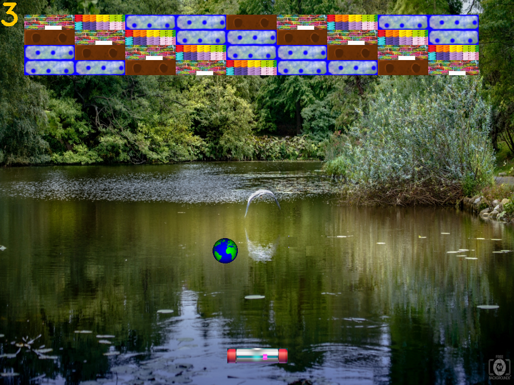

Brick Breaker Game!
===================



Download the *
*[Startup Code from here](https://codallehmoodle.online/pluginfile.php/585/mod_page/content/8/BrickBreaker.zip)** !

In this game, we will start working with real images and adding some basic animation features.

You will be using a simplified version of **OpenCV =** **Open**-Source **C**omputer **V**ision library.

Step 1: Set up
--------------

Download the project template and open the `BrickBreaker solution`.

(`Rclick ->`) Set `BrickBreaker_Test` project as a `Startup Project`. Run and see all the wonderful unit test failures
that pop out in the console. Pretty, hu?

### Optional: Practice OpenCV:
You have the `SnadBox.c` file to learn and practice the most common commands in OpenCV.
Set the `OpenCV_Playground` project as the `Startup Project`, and now you can run this.
Look at the code in the file, and play with parameters, etc.

Don't forget to restore the `Startup Project` to `BrickBreaker_Test`.

Step 2: Points
--------------

Open `Geometry.h` and take a look on the two custom types there:

1. The two dimensional Point:

```c
typedef union
{
    float coords[2];
    struct
    {
        float x;
        float y;
    };
} Point;
```

It’s a `union` for allowing access both as an array and with members (note! The inner struct is name-less!). So, for
a `Point p = {.x = 10, .y = 20};` both `p.coords[0]` and `p.x` refer to the same variable! (yes! Exactly the same place
in memory! It’s a union!)

Now go ahead and :

1. implement in the `Point_????` Functions so that the relevant tests  
   (under `GeometryTest_main`) pass!

2. Commit & Push!

Now that you’ve done with Points, let’s move on – to Rectangles.

Step 3: Rectangles
------------------


The two-dimensional Rectangle:

```C
typedef union
    {
    float arr[4];
    struct
    {
        float x;
        float y;
        float width;
        float height;
    };
    struct
    {
        Point TL;
        Point WH;
    };
} Rect;
```

This union allows three alternative ways to access the memory of a variable of type Rect:


<table>
   <thead>
      <tr>
         <th>Sample memory addresses</th>
         <th>Access with arr</th>
         <th>Access with first struct</th>
         <th>Access with second struct</th>
      </tr>
   </thead>
   <tbody>
      <tr>
         <td>0x1DDE39F8<strong>28</strong></td>
         <td>arr[0]</td>
         <td>x</td>
         <td rowspan=2><code>TL</code> (top left corner coordinates)</td>
      </tr>
      <tr>
         <td>0x1DDE39F8<strong>2C</strong></td>
         <td>arr[1]</td>
         <td>y</td>
      </tr>
      <tr>
         <td>0x1DDE39F8<strong>30</strong></td>
         <td>arr[2]</td>
         <td>width</td>
         <td rowspan=2><code>WH</code> (width &amp; height)</td>
      </tr>
      <tr>
         <td>0x1DDE39F8<strong>34</strong></td>
         <td>arr[3]</td>
         <td>height</td>
      </tr>
   </tbody>
</table>

Now go ahead and :

   3. implement in the `Rect_????` functions so that the relevant tests  
   (under `GeometryTest_main`) pass!

   4. Commit & Push!


2. A Geometric Riddle: What does `Rect Rect_GuessWhat(Rect const* r1, Rect const* r2)`  do?  
   After you figure that out, rename `Rect_GuessWhat` to some meaningful name all over the solution! You can do that by
   “replace all” (Ctrl+Shift+H) or by Refactor-Rename (Ctrl + R + R – just hold the Ctrl and press “R” twice).

Step 3: FileUtils
-----------------

Here we will write all the functions that will help us with files. Read carefully the documentation at `FileUtils.h`, then
go ahead and implement the functions.

1. `bool isFileExists(const char* filepath)`

2. `char* concatPaths(const char* root, const char* toAppend)`

3. `getFramePath`, and `countAnimationFrames` is already implemented, based on the two functions above that you have to fill
   in. go over the implementation, see that you understand what’s going on 😊

When all `FileUtilsTest_main` unit tests pass, commit & push!


Step 4: Entity
--------------

Read carefully the description of the members in the `Entity struct`, and find out in `Entity.c` which functions it’s up to
you to implement (search for `TODO` in this file). Pay attention to the function descriptions in the `Entity.h` file.

Why do we describe functions in the `.h` file and not in the `.c` file? Because the `.h` file is visible to our code users,
they shouldn’t dig into implementation to understand what’s going on!

**Note:** since linked list is represented by it’s anchor,  
we `typedef`ed `LinkedList` to be a synonym to `Link *`.

Again, fill in the blanks in Entity.c till `EntityTest_main` Pass!

**Tip!:** Read `core.h` file and find out the usefull functions.

Commit & Push.

At this point, you should be able to set `BrickBreakerRunner` as a `startup project` and enjoy the game 😊


Step 5: Game
------------

In this project, the game class was written for you. Go over its code in Game.h and Game.c and make sure you understand
it, you can fill in the TODOs if you’d like – not a must.

How do we check collisions?

`Last modified: Thursday, 1 march 2024, 14:14`